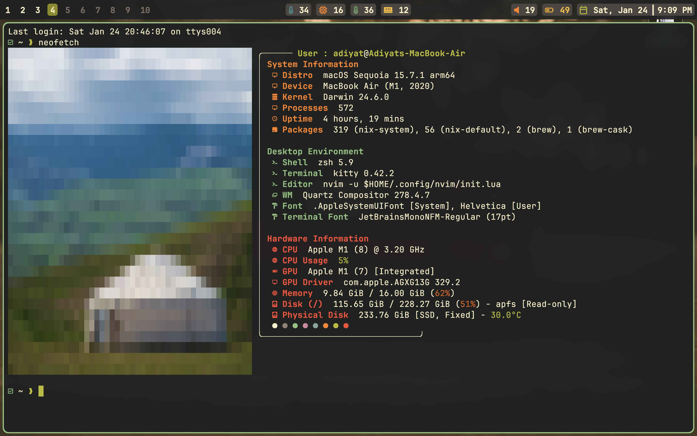

<h1 align="center">:apple: dotfiles</h1>

> [!IMPORTANT]
>
> - **There are no install (reproduce) scripts in this repository, as I do not allow anybody to use this configuration as is. But feel free to take some parts/ideas of my config for your own one.**
> - **This repo is smaller, because it only includes macOS-speicifc files, other files are in [**the main dotfiles repo**](https://github.com/adiyat-abubakirov/dotfiles).**
> - **Neovim dotfiles are stored in another repository ([**atom-vim**](https://github.com/adiyat-abubakirov/atom-vim)).**
> - **Wallpapers are from the "wallhaven" website.**

## :green_book: About

- OS: **`macOS`**
- Shell: [**`Zsh`**](https://www.zsh.org/)
- Custom Shell Prompt: [**`Oh My Posh`**](https://ohmyposh.dev/) & [**`Oh My Zsh`**](https://ohmyz.sh/)
- Terminal: [**`Kitty`**](https://sw.kovidgoyal.net/kitty/)
- Main Code Editor: [**`Neovim`**](https://neovim.io/)\*
- Window Manager: [**`Yabai`**](https://github.com/asmvik/yabai)
- Status Bar: [**`Sketchybar`**](https://github.com/FelixKratz/SketchyBar)
- Hotkey Daemon: [**`Skhd`**](https://github.com/FelixKratz/SketchyBar)
- App Launcher: **`Spotlight`**
- File Manager: [**`LF`**](https://github.com/gokcehan/lf)
- System Monitoring: [**`Btop`**](https://github.com/aristocratos/btop)
- System Info Fetch Software: [**`Fastfetch`**](https://github.com/fastfetch-cli/fastfetch)
- Main Font: [**`JetBrainsMono Nerd Font`**](https://github.com/ryanoasis/nerd-fonts)
- Color Scheme: [**`Gruvbox`**](https://github.com/morhetz/gruvbox)

\* - I use Neovim with my own configuration, no forks. 

---

<h3 align=center>If you found this repository helpful, please give it a :star:</h3>
